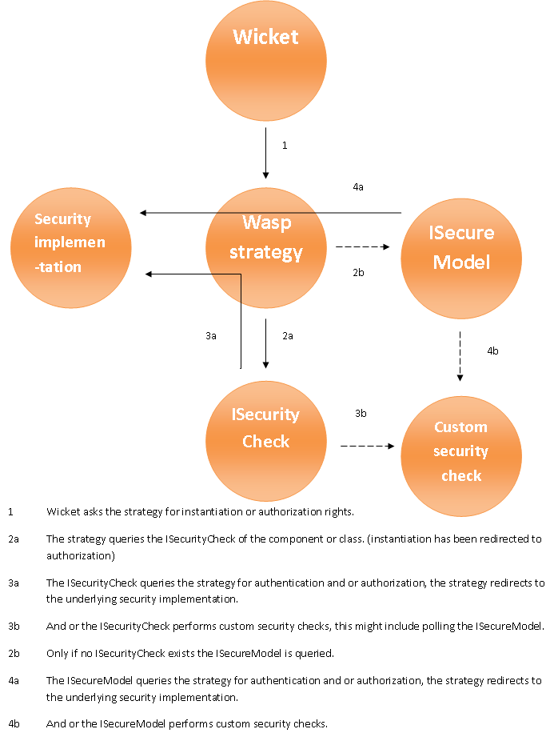

Wicket Security uses the available security mechanisms from Wicket to build
upon and expand the authentication and authorization mechanisms. In order to
maximize flexibility and customization a new API, called WASP, was build on
top of Wicket.

WASP
====

Wicket Abstract Security Platform, or Wasp for short, builds on the
`IAuthorisationStrategies` provided by Wicket and allows individual components
or models to do their own authentication and or authorization checks.

Like Wicket it uses actions to grant permissions, however where Wicket uses
string based actions (render and enable) we use full blown java objects. We
also decided to add the following 2 actions:

 * access, checks for component instantiation rights

 * inherit, allows container components like `Page` and `Panel` to make
   certain permissions inheritable to all their children

An `ActionFactory` makes it possible to define your own custom actions.

Actions
-------

Wicket is only aware of the render and enable actions. They are used for
making components invisible (render), read only and clickable (enable). Swarm
adds the access action for component instantiation and the inherit action for
permission inheritance. Actions can imply other actions by default all actions
imply the access action and the enable action implies the render action. This
means if you specify that a permission has the "enable" action what you really
get is "access, render, enable". This also means that if you specify a
permission without any explicit actions you will automatically get the
"access" action.

Authentication
--------------

Authentication in Wasp is handled by the `WaspAuthorizationStrategy` which
provides you with a general login/logoff method. By using an unspecified
"context" object you can use not only username password authentication but
pretty much everything you can think of. You can even use multi-login as is
often used in online banking.

Authorization
-------------

As briefly mentioned above Wasp allows your individual components to handle
their own authentication and authorization requirements.

To enable security on a component there are 3 paths to choose from:

 * Enhance an existing component by adding an `ISecurityCheck` like the
   `SecureComponentCheck`. This gives you a fair amount of control with the
   least amount of effort.

 * Use an `ISecureModel` on the component. Giving you control over reading and
   writing to and from components as you require.

 * Have your component implement the `ISecureComponent` interface allowing you
   complete control every step of the way.

Wasp uses `ISecuityCheck`s to dictate how to handle a component, only one
check may be placed on a component but by chaining or wrapping them in other
checks you can go as complex as you like. For ease of use and re usability
most `ISecurityCheck`s will not know anything about how to actually authorize
or authenticate, but the `IAuthorizationStrategy` does so most should just
redirect (possibly doing some stuff of their own). The picture below tries to
clarify this a bit.

It may seem strange at first that the `ISecureModel` is only queried if an
`ISecurityCheck` is absent, but once you realize that the `ISecuityCheck`
itself could query the model it becomes clear that this offers greater
flexibility by allowing you the choice of an And or Or check.

Note that if the component implements the `ISecureComponent` interface that
will be used instead of the `ISecurityCheck`.

Besides an API to implement by yourself Wicket-Security also contains a
default implementation, called SWARM, so you can get started right away, or at
least you have a reference to build your own

More information 

 * [Get started with Swarm](gettingstarted.html)

 * [Integrate with Spring Security]()

 * Examples are available here

 * FAQ is located here

 * A SlideShow is located here
